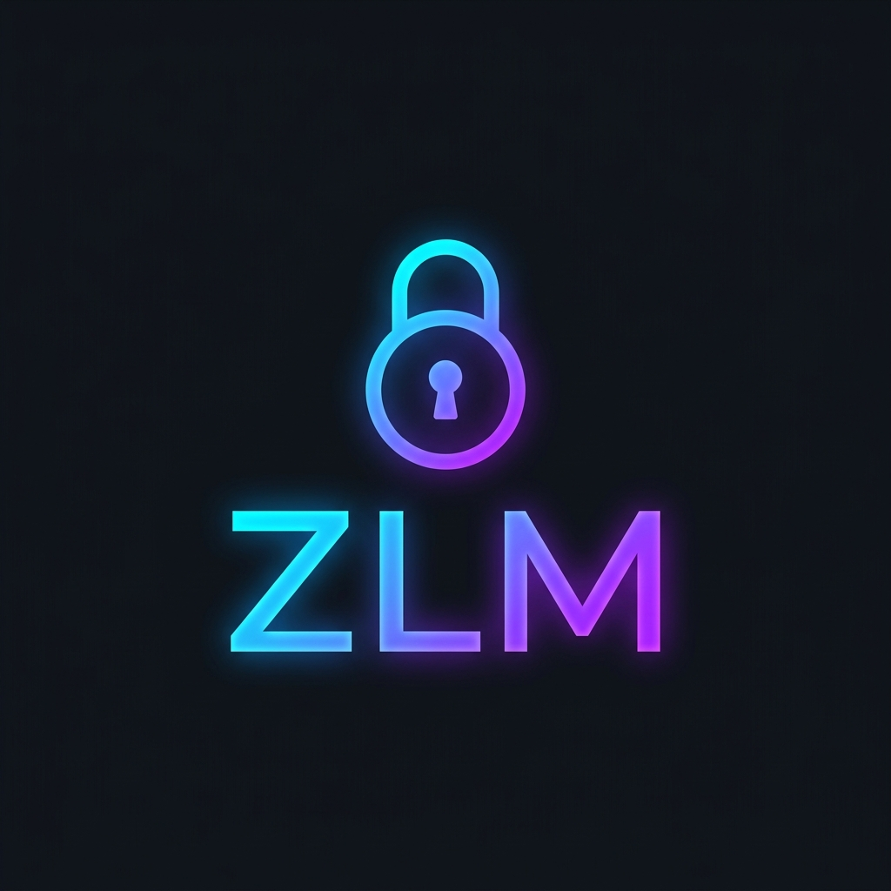

# Zigbee2MQTT Lock Manager

  

A Home Assistant integration to manage PIN codes for Zigbee smart locks via Zigbee2MQTT.

## Features
*   **Native Sidebar Panel:** Specialized UI that integrates perfectly with the Home Assistant sidebar and header.
*   **Code Management:** Set codes, names, and enable/disable users.
*   **Scheduling:** Advanced modes including Always Active, Recurring (Weekly), and Temporary (Date Range).
*   **Real-time Activity Log:** Context-aware history of lock actions and code usage.
*   **MQTT Synchronization:** Bidirectional sync with Zigbee2MQTT.
*   **Sync Mismatch Recovery:** Detects and resolves discrepancies between Home Assistant and the physical lock.

## Installation

1.  Copy the `custom_components/z2m_lock_manager` directory to your Home Assistant `custom_components` folder.
2.  Restart Home Assistant.
3.  Go to **Settings > Devices & Services**.
4.  Click **Add Integration** and search for "Zigbee2MQTT Lock Manager".
5.  Enter your MQTT Root Topic (e.g., `zigbee2mqtt/front_door`) and the number of slots to manage.
6.  The "Lock Manager" item will appear in your sidebar.

## Usage

1.  Click **Lock Manager** in the sidebar.
2.  **Dashboard:** View active users and current slot utilization.
3.  **Add/Edit User:** Create new PIN codes and set access schedules (Always, Recurring, Temporary).
4.  **Real-time Sync:** View the sync state (Synced, Pending, or Mismatch).
5.  **Mismatch Handling:** If the physical lock's state differs from HA, you can use the **Import from Lock** or **Write to Lock** buttons to reconcile state.
6.  **Activity Log:** Track exactly who accessed the lock and when, with automatic resolution of user names.

## Development

The frontend is built with React and Vite.
1.  Navigate to `frontend/`.
2.  Run `npm install`.
3.  Run `npm run build` to generate the panel source in `custom_components/z2m_lock_manager/www/`.
